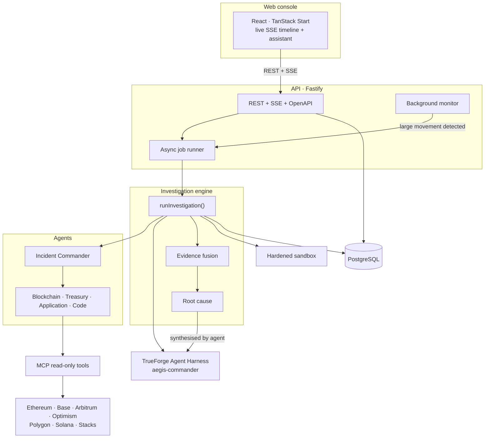
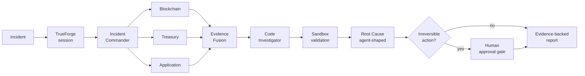
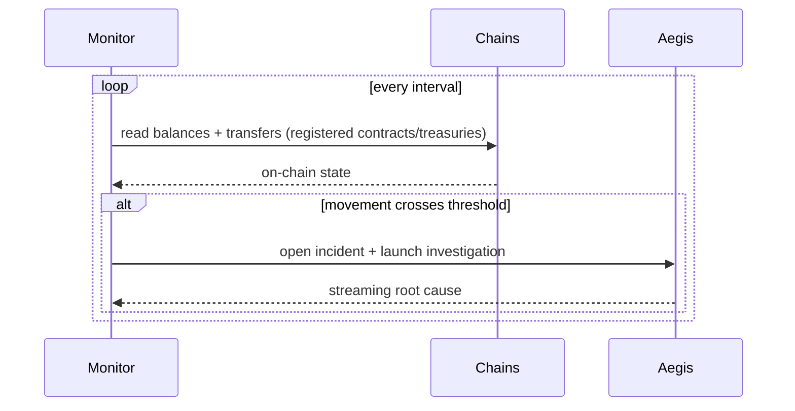

# Aegis

**An AI first responder for blockchain protocols.**

When something goes wrong on chain, a treasury draining below its gas reserve, a contract acting up, or funds moving unexpectedly, Aegis investigates on its own and returns a root cause you can actually trust, backed by real evidence. Anything irreversible stops for a human to approve.

Autonomous agents. Real on-chain data across seven chains. Live in production.

---

## Why

On-chain incidents are fast and impossible to undo, and they touch several things at once: chain state, treasury health, application behaviour, and the protocol's own code. Today a team firefights across explorers, RPCs, dashboards, and repos while money is on the line. Nothing investigates the whole thing end to end and explains *why* it happened.

Aegis is that first responder. It starts triaging before anyone is even awake.

---

## Architecture



---

## How an investigation runs



Every stage streams a structured event, so you watch the whole thing happen live. Specialists run in parallel and failures are isolated: one investigator can never take down the run. When the harness is connected, `aegis-commander` reads the real findings and writes the final root cause, so the conclusion is specific to that incident, not a template.

### The autonomous monitor



---

## What it does

- **Autonomous multi-agent investigation.** A commander dispatches specialists, fuses their findings, validates the theory in a sandbox, and produces a confidence-scored root cause.
- **Real on-chain data, not mocks.** Balances, contract state, and actual recent transactions across seven chains.
- **A background monitor** that opens an incident and investigates on its own when funds move past a threshold.
- **An agentic assistant** you can talk to. Ask it to analyse an incident or investigate a contract in plain language and it calls the right tools itself.
- **Human in the loop.** Any sensitive or irreversible step stops at an approval gate. The agents do the grunt work, you stay in control.
- **Wallet or Google sign in**, per-user data isolation, and a live console that streams every step.

---

## Chains

| Chain | Family | Data source |
|---|---|---|
| Ethereum, Base, Arbitrum, Optimism, Polygon | EVM | viem over public RPC (or your own) |
| Solana | SVM | JSON-RPC |
| Stacks | Stacks | Hiro API |

Each reads native balance, whether an address is a contract, and recent real transactions, with block-explorer links.

---

## Built on

- **TrueForge (TrueFoundry Agent Harness)** is the real agent runtime. A deployed `aegis-commander` agent drives investigations, shapes the root cause from real evidence, and powers the assistant through streaming turns. It degrades to a deterministic local runtime if the gateway is unreachable, so the product never breaks.
- **A real MCP server** exposes the read-only tools, sharing the exact handlers used in-process.
- **Qodo** reviewed every meaningful change through pull requests before merge.

---

## Quick start

Requires **Node 22** and **pnpm 10**.

```bash
pnpm install
pnpm demo
```

`pnpm demo` runs the full pipeline end to end (session, commander, three investigators, fusion, code investigator, sandbox, root cause) and streams the event timeline. No credentials, database, or network required.

### Run the console + API locally

```bash
docker compose up -d postgres      # Postgres on :5544
pnpm db:migrate                    # apply migrations
pnpm --filter @aegis/api dev       # API on :4000
cd apps/web && pnpm dev            # console on :3000
```

Copy [`.env.example`](.env.example) to `.env`. The only thing the API needs is `DATABASE_URL`; set `TRUEFORGE_API_URL` + `TRUEFORGE_API_KEY` to run against the real harness, and `CHAIN_RPC_*` to use your own RPCs.

### MCP server

```bash
pnpm mcp     # stdio MCP server exposing the read-only Aegis tools
```

---

## Deployment

The stack runs split: the console on Netlify and the API on Render against a managed Postgres (Neon). The API ships as a single Docker image ([Dockerfile](Dockerfile)) that migrates on start.

Auth is token based (bearer), so the console and API can live on different domains with no cookie or proxy gymnastics. Set `VITE_API_BASE_URL` on the console and `CORS_ORIGINS` on the API to each other's origins.

---

## Security

Aegis is read-only and isolated. No signing, no transactions, no fund movement.

- Every investigation tool is schema-validated, read-only, and path-jailed.
- The sandbox treats generated code as untrusted: a hardened Docker container (`--network none`, non-root, read-only rootfs, resource limits) when available, or a locked-down subprocess isolate otherwise. Never `eval` on the host.
- The API validates input, sets security headers, requires an explicit CORS allowlist in production, limits body size, and never leaks stack traces.
- Any future remediation stops at a human approval boundary.

---

## Project structure

A strict-TypeScript pnpm monorepo.

| Package | Responsibility |
|---|---|
| `packages/shared` | Domain types and Zod schemas. |
| `packages/blockchain` | Multichain reads (EVM, Solana, Stacks), address validation, explorer links. |
| `packages/mcp` | Read-only tools + a real MCP server. |
| `packages/trueforge` | Agent-harness session, runners, approval controller. |
| `packages/agents` | Incident Commander and the investigators. |
| `packages/incident-engine` | Evidence fusion, root cause, and the `runInvestigation` orchestrator. |
| `packages/sandbox` | Hardened Docker + subprocess sandbox drivers. |
| `packages/database` | PostgreSQL + Drizzle schema, migrations, repositories. |
| `apps/api` | Fastify REST + SSE + OpenAPI, monitor, assistant, job runner. |
| `apps/web` | The console (React, TanStack Start). |

---

## Qodo code review evidence

Every meaningful change went through a pull request so [Qodo](https://www.qodo.ai/) could review it before merge.

**Reviewed and merged:** [PR #1](https://github.com/cypherpulse/Aegis/pull/1). Qodo's automated review found four real bugs, all fixed before merge:

1. The production Dockerfile omitted the root-level `simulator` workspace, so the image would never build.
2. The `aegis-mcp` binary had no launcher and would not start.
3. The Docker Compose API service dropped documented runtime settings.
4. A security bug: credentialed CORS defaulted to reflecting any origin, so any site could make authenticated requests. Production now requires an explicit allowlist.

The PR thread shows the automated review, our fixes, and the follow-up review.

---

## License

MIT. See [LICENSE](LICENSE).
